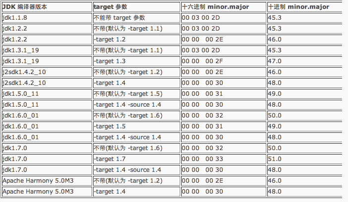
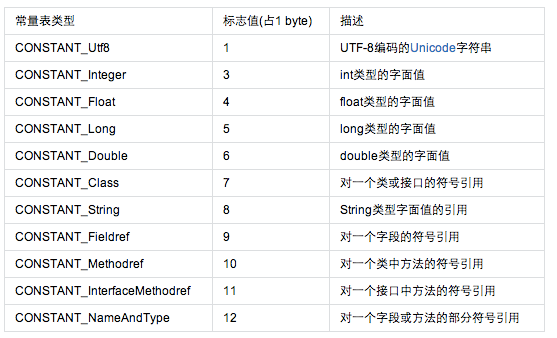
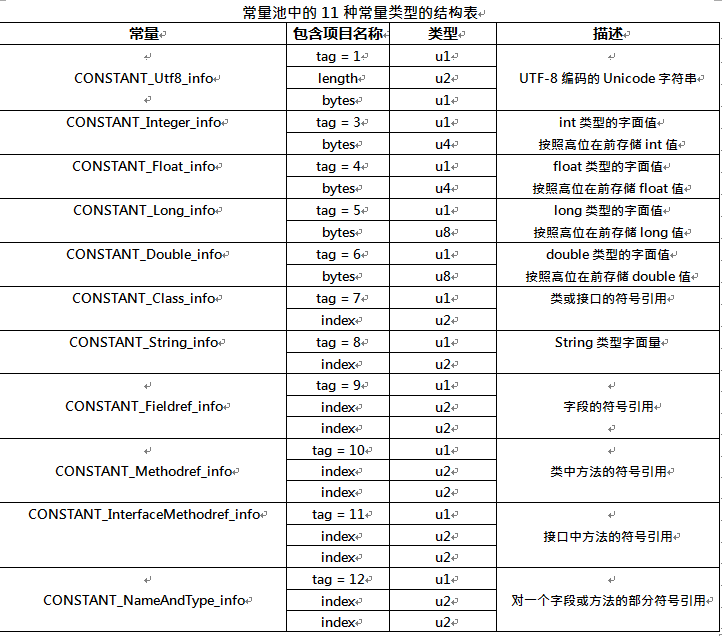
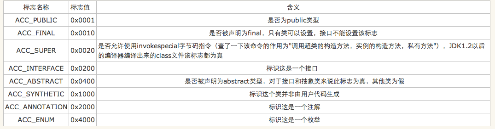
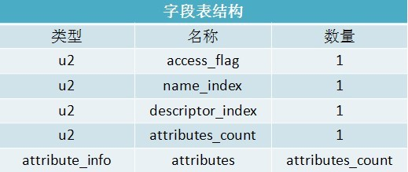
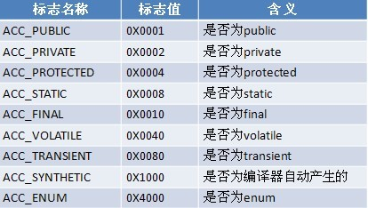
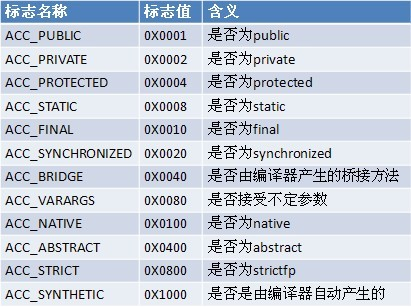
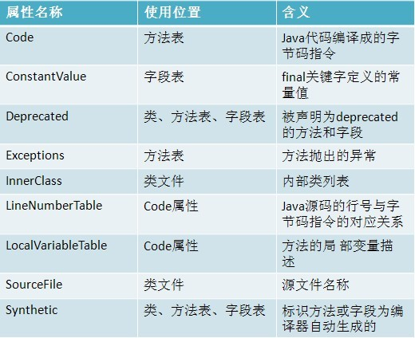
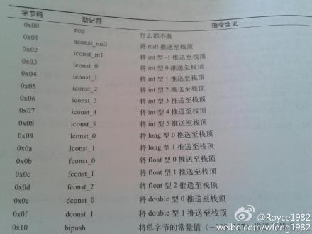

#深入JVM的Class文件结构

Class文件由顺序的8位字节为基础单位构成的二进制流。各个项目严格按照顺序紧凑排列，无分隔符。

需要用8位字节以上空间数据项时按照高位在前分割成若干个8位字节存储。

只包含2种数据类型：

* 无符号数
* 表

##无符号数

是class文件基本数据类型，以u1,u2,u4,u8分别代表1个字节，2个，4个，8个字节的无符号数。可以用来描述数字、索引引用、数量值、以UTF-8编码构成的字符串。

##表
由多个无符号数或其他表作为数据项构成的复合数据类型。所有表以“_info”结尾。用来描述具有层次关系的复合结构数据。

其实class文件本质上就是一张表。

##Class文件结构

包含magic魔数，文件版本,常量池，访问标识，类索引、父类索引与接口索引集合，字段表集合，方法表集合，属性表集合等构成

###魔数
在class文件头4个字节，magic number。
作用：确定该文件是否是虚拟机可接受的class文件。java的魔数统一为 0xCAFEBABE  (来源于一款咖啡)。

###版本号
由minor_version和major_version组成，占用文件中第5到8字节。
如  
CA FE BA BE 00 00 00 32 
 表示此版本号为50.0，十进制表示一般格式为 major.minor
需要注意的是java版本号是从45开始的，大版本发布，主版本号+1.高版本的jdk能向下兼容以前版本的class文件，但不兼容以后版本的class文件。

各jdk编译后的class文件版本号如下：

###常量池
紧接着版本号后就是常量池入口。是第一个出现的表类型的数据项目。
由常量池容量计数值constant\_pool\_count及常量池constant\_pool组成。
constant\_pool\_count占2个字节。如 0x0016 即十进制的22，表示有21项常量，从1开始到21.  
0有特殊含义，表示指向常量池的索引值数据**不引用**任何一个常量池项目。

常量池主要存放字面量Literal和符号引用Symbolic References。

字面量可能是文本字符串，或final的常量值。
符号引用包括以下：
* 类或接口全限定名 Full Qualified Name
* 字段名称和描述符 Descriptor
* 方法名称和描述符

常量池共有11种表结构数据。

每个表均开始的第一位是u1类型的标志位，表示哪种常量类型。但每个表的结构都不相同。
如类或接口的符号引用为CONSTANT_Class_info.

所有的常量池结构严格以标志位，表结构其他数据类型 顺序排列。
各类型常量池表结构如下表所示：

实际中可以使用 javap -verbose  XXX.class  输出字节码内容。

###访问标志access_flags
u2类型,识别类或接口层次的访问信息，如class是接口或类，是否public，是否abstract，是否final等。

###类索引、父类索引与接口索引集合
类索引this\_class及父类索引super\_class均是u2类型，接口索引集合interfaces是一组u2类型的集合。确定类的继承关系.按照顺序排列在访问标志之后。this\_class,super\_class指向CONSTANT\_CLASS\_info常量。通过该常量可以找到定义在CONSTANT\_Utf8\_info的全限定名字符串。

###字段表集合field_info
紧接在interface后面的是fields_count的计数，它是类变量和实例变量的字段的数量总和。在这个计数后面的是不同长度的field_info表的序列(fields_count指出了序列中有多少个field_info表)。

描述接口或类中声明的变量，包含类级变量或实例级变量，不包含方法变量。信息包含：字段作用域、字段类型（类变量还是实例变量 static）、可变性（final）、并发可见性（volatile）、可否序列化（transient）、字段数据类型、名称等。
结构如下表：

字段修饰符放在access_flags项目中，它与类中的access_flags项目是非常相似的，都是一个u2的数据类型，其中可以设置 的标志位和含义如下表所示

name_index和descriptor_index都是对常量池的引用，分别代表着字段的简单名称及字段和方法的描述符.其中描述符的作用是用来描述字段的数据类型、方法的参数列表（包括数量、类型以及顺序）和返回值。根据描述符规则，基本数据类型(byte、char、double、float、int、long、short、boolean)及代表无返回值的void类型都用一个大写字符来表示，而对象类型则用字符L加对象的全限定名来表示。

对于数组类型，每一个维度将使用一个前置的"["字符来描述，如一个定义的"java.lang.String[][]"类型的二维数组，将被记录为:"[[Ljava/lang/String;",一个整型数组"int[]"将被记录为"[I"

   用描述符来描述方法时，按照**先参数列表，后返回值**的顺序描述，参数列表按照参数的严格顺序放在一组小括号"()"之内。如方法void inc()的描述符为"()V"，方法java.lang.String.toString()的描述符为"()Ljava/lang/String;"。int IndexOf(char[] source,int sourceOffset,int sourceCount,char[] target int targetOffset,int targetCount,int fromIndex) 表示为([CII[CII)I.
   
   在后面是attributes_count和attributes,分别表示属性计数器和属性信息，用来表示字段的额外属性，如果属性计数器为0，表示无额外属性。如 
   
   *final static int m=500;*
   
   此时attributes_count为1，表示有1个属性，属性ConstantValue指向常量池中得常量500.
   字段表集合不会列出从超类或父接口中继承来的字段，但可能包含原代码中不存在的字段，如内部类中为了保持对外部类的访问性，会自动添加指向外部类的字段。
   
   java中类变量或实例变量不能重名，但在字节码中，只要描述符不一致，字段重名也是合法的。
   
###方法表集合methods_info
   紧接着field后面的是对在该类或者接口中所声明的方法的描述。其结构与fields一样，不一样的是访问标志。
   
   访问标志中没有了ACC_VOLATILE和ACC_TRANSIENT标志。增加了ACC_SYNCHRONIZED,ACC_NATIVE,ACC_STRICTFP,ACC_ABSTRAT.
   
*附：strictfp（strict float point (精确浮点)）用法*

*strictfp 关键字可应用于类、接口或方法。使用 strictfp 关键字声明一个方法时，该方法中所有的float和double表达式都严格遵守FP-strict的限制,符合IEEE-754规范。当对一个类或接口使用 strictfp 关键字时，该类中的所有代码，包括嵌套类型中的初始设定值和代码，都将严格地进行计算。严格约束意味着所有表达式的结果都必须是 IEEE 754 算法对操作数预期的结果，以单精度和双精度格式表示。*

方法里的代码经过编译器编译成字节码指令之后，存放在方法属性表集合中Code得属性里面。

另外如果父类方法在子类中没有被重写（Override）,方法表集合就不会出现来自父类的方法信息。同时，也可能出现编译器自动添加的方法，如类构造器<clinit>和实例构造器<init>方法。

java中方法都有一个特征签名，指的就是一个方法中各参数在常量池中字段符号引用的集合。这里并不包含返回值，所以java中重载不能仅仅依靠返回值不同。**但对于class文件，只要描述符不同的方法就可以共存在一个class文件中，所以两个方法有相同的名称和特征签名，但返回值不同，在class文件中可以共存**。

###属性表集合attribute_info
class文件中最后的部分是属性，它给出了在该文件类或者接口所定义的属性的基本信息。属性部分由attributes_count开始，attributes_count是指出现在后续attributes列表的attribute_info表的数量总和。每个attribute_info的第一项是指向常量池中CONSTANT_Utf8_info表的引用，该表给出了属性的名称。

   
属性表用来表示专用场景的专有信息，比如前面的字段表、方法表都有自己的属性信息。这里不要求严格的顺序，只要不与已有属性名重复，任何人实现的编译器都可以向属性表写入自定义的属性信息。jvm运行时会忽略掉不认别的属性。

《Java虚拟机规范(第2版)》预定义了9项属性。

每个属性的名称需要从常量池中引用一个CONSTANT_Utf8_info类型的常量表示。属性值结构完全自定义，只要说明属性值占用的位数长度即可。

| 类型   |          名称                           | 数量
|-------|-------------------------|-----------------
| u2    |   attribute_name_index  | 1
| u2    |   attribute_length      | 1
| u1    |   info                  | attribute_length

####Code属性

其中max_stack表示操作数栈（operand stacks）深度最大值，jvm根据该值分配栈帧Frame中操作栈深度。

max_locals表示局部变量表所需存储空间。单位是Slot，虚拟机为局部变量分配内存的最小单位。对byte、char,float,int,short,boolean,reference,returnAddress等长度不超过32位的数据类型，占用1Slot.而double,long类型需要2Slot。

方法中的局部变量表存放的包括实例方法隐藏参数this，显示异常处理的参数（ExceptionHandler Parameter），方法体中用的局部变量等。同时局部变量表中得Slot可以重用，编译器根据变量作用域来分类Slot，并分配给各变量使用，然后计算max_locals。

code和code_length存储字节码指令。每个指令为u1类型的单字节，取值范围为0x00~0xFF,十进制的0~255.既可以表达256个指令。目前jvm定义了约200条编码值对应的指令含义。部分指令码含义摘录如下：

另外code_length是u4类型的长度值，理论上最大值可以是2^32-1，但jvm规范规定一个方法不允许超过65535条，否则编译器会拒绝编译。

